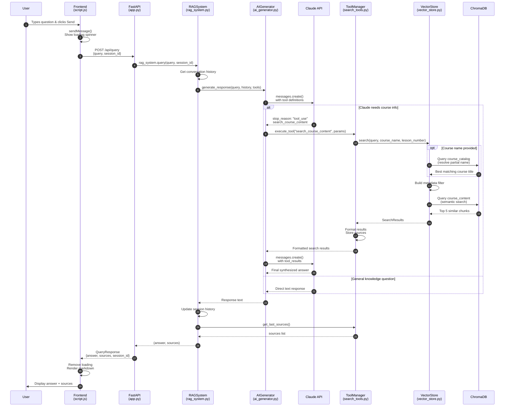
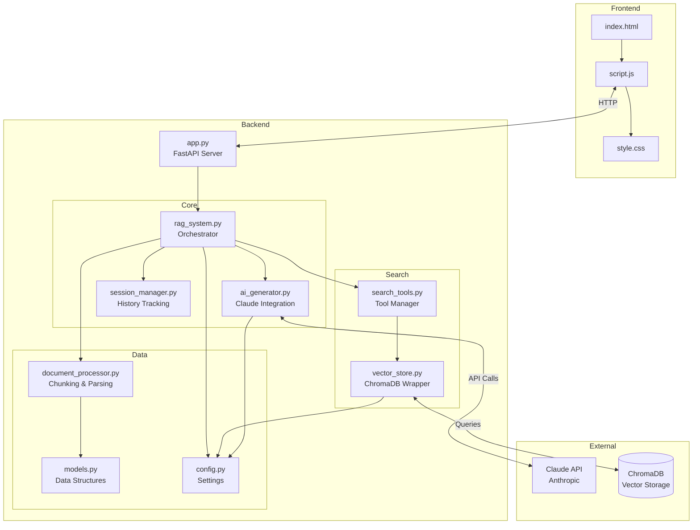
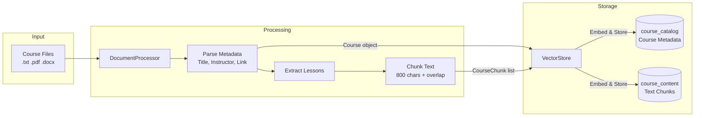
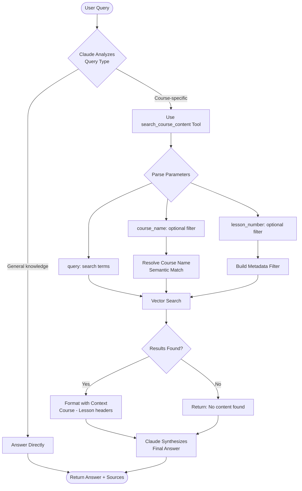

# RAG Chatbot Query Flow Diagram

```mermaid
sequenceDiagram
    autonumber
    participant U as User
    participant FE as Frontend<br/>(script.js)
    participant API as FastAPI<br/>(app.py)
    participant RAG as RAGSystem<br/>(rag_system.py)
    participant AI as AIGenerator<br/>(ai_generator.py)
    participant Claude as Claude API
    participant TM as ToolManager<br/>(search_tools.py)
    participant VS as VectorStore<br/>(vector_store.py)
    participant DB as ChromaDB

    U->>FE: Types question & clicks Send
    FE->>FE: sendMessage()<br/>Show loading spinner
    FE->>API: POST /api/query<br/>{query, session_id}

    API->>RAG: rag_system.query(query, session_id)
    RAG->>RAG: Get conversation history
    RAG->>AI: generate_response(query, history, tools)

    AI->>Claude: messages.create()<br/>with tool definitions

    alt Claude needs course info
        Claude-->>AI: stop_reason: "tool_use"<br/>search_course_content
        AI->>TM: execute_tool("search_course_content", params)
        TM->>VS: search(query, course_name, lesson_number)

        opt Course name provided
            VS->>DB: Query course_catalog<br/>(resolve partial name)
            DB-->>VS: Best matching course title
        end

        VS->>VS: Build metadata filter
        VS->>DB: Query course_content<br/>(semantic search)
        DB-->>VS: Top 5 similar chunks
        VS-->>TM: SearchResults
        TM->>TM: Format results<br/>Store sources
        TM-->>AI: Formatted search results

        AI->>Claude: messages.create()<br/>with tool_results
        Claude-->>AI: Final synthesized answer
    else General knowledge question
        Claude-->>AI: Direct text response
    end

    AI-->>RAG: Response text
    RAG->>RAG: Update session history
    RAG->>TM: get_last_sources()
    TM-->>RAG: sources list
    RAG-->>API: (answer, sources)

    API-->>FE: QueryResponse<br/>{answer, sources, session_id}
    FE->>FE: Remove loading<br/>Render markdown
    FE->>U: Display answer + sources
```

## Component Architecture

```mermaid
flowchart TB
    subgraph Frontend
        UI[index.html]
        JS[script.js]
        CSS[style.css]
    end

    subgraph Backend
        APP[app.py<br/>FastAPI Server]

        subgraph Core
            RAG[rag_system.py<br/>Orchestrator]
            AI[ai_generator.py<br/>Claude Integration]
            SM[session_manager.py<br/>History Tracking]
        end

        subgraph Search
            TM[search_tools.py<br/>Tool Manager]
            VS[vector_store.py<br/>ChromaDB Wrapper]
        end

        subgraph Data
            DP[document_processor.py<br/>Chunking & Parsing]
            MOD[models.py<br/>Data Structures]
            CFG[config.py<br/>Settings]
        end
    end

    subgraph External
        CLAUDE[Claude API<br/>Anthropic]
        CHROMA[(ChromaDB<br/>Vector Storage)]
    end

    UI --> JS
    JS --> CSS
    JS <-->|HTTP| APP

    APP --> RAG
    RAG --> AI
    RAG --> SM
    RAG --> TM

    AI <-->|API Calls| CLAUDE
    TM --> VS
    VS <-->|Queries| CHROMA

    RAG --> DP
    DP --> MOD
    RAG --> CFG
    VS --> CFG
    AI --> CFG
```

## Data Flow: Document Ingestion

```mermaid
flowchart LR
    subgraph Input
        FILES[Course Files<br/>.txt .pdf .docx]
    end

    subgraph Processing
        DP[DocumentProcessor]
        PARSE[Parse Metadata<br/>Title, Instructor, Link]
        LESSONS[Extract Lessons]
        CHUNK[Chunk Text<br/>800 chars + overlap]
    end

    subgraph Storage
        VS[VectorStore]
        CAT[(course_catalog<br/>Course Metadata)]
        CON[(course_content<br/>Text Chunks)]
    end

    FILES --> DP
    DP --> PARSE
    PARSE --> LESSONS
    LESSONS --> CHUNK

    PARSE -->|Course object| VS
    CHUNK -->|CourseChunk list| VS

    VS -->|Embed & Store| CAT
    VS -->|Embed & Store| CON
```

## Query Decision Flow

```mermaid
flowchart TD
    START([User Query]) --> CLAUDE{Claude Analyzes<br/>Query Type}

    CLAUDE -->|Course-specific| TOOL[Use search_course_content Tool]
    CLAUDE -->|General knowledge| DIRECT[Answer Directly]

    TOOL --> PARAMS{Parse Parameters}
    PARAMS --> QUERY[query: search terms]
    PARAMS --> COURSE[course_name: optional filter]
    PARAMS --> LESSON[lesson_number: optional filter]

    QUERY --> SEARCH[Vector Search]
    COURSE --> RESOLVE[Resolve Course Name<br/>Semantic Match]
    RESOLVE --> SEARCH
    LESSON --> FILTER[Build Metadata Filter]
    FILTER --> SEARCH

    SEARCH --> RESULTS{Results Found?}
    RESULTS -->|Yes| FORMAT[Format with Context<br/>Course - Lesson headers]
    RESULTS -->|No| EMPTY[Return: No content found]

    FORMAT --> SYNTH[Claude Synthesizes<br/>Final Answer]
    EMPTY --> SYNTH
    DIRECT --> RESPONSE
    SYNTH --> RESPONSE([Return Answer + Sources])
```
